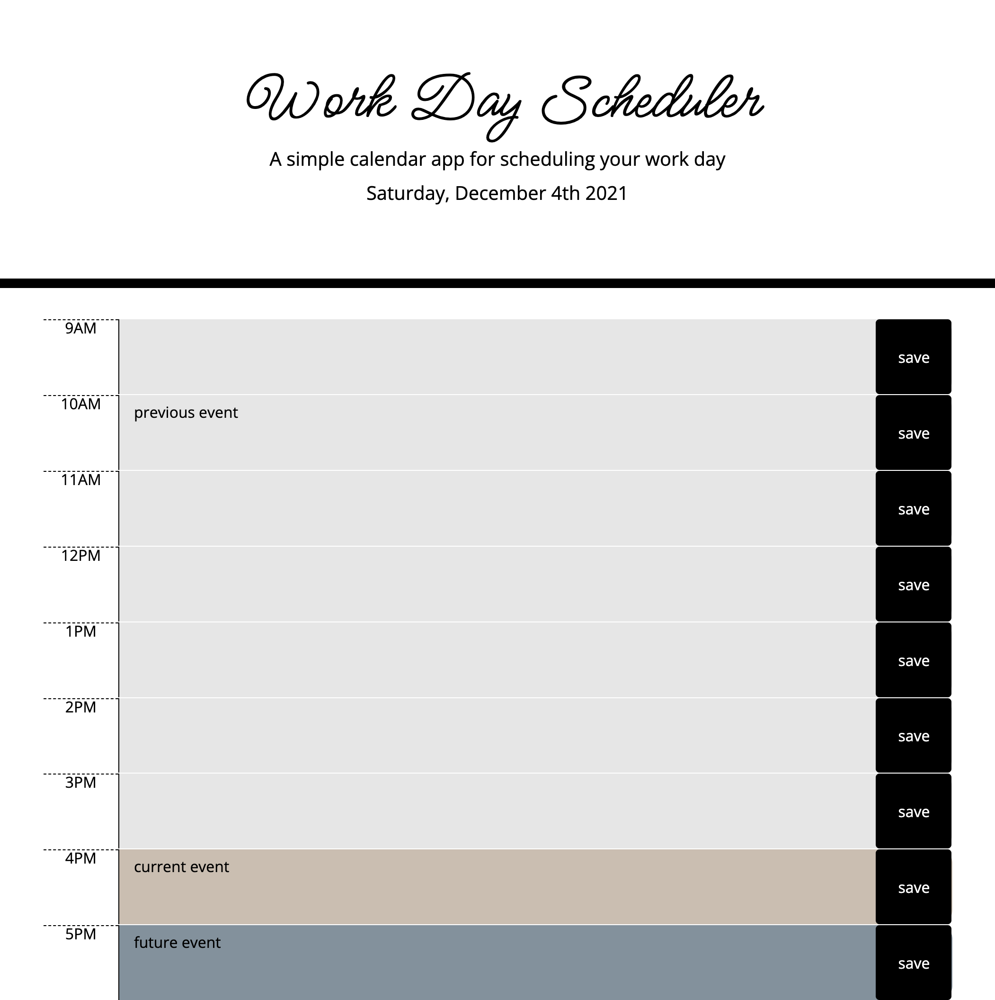

# day-planner

This workday planner gives the user the ability to enter their daily events by hour from 9 am to 5pm. The planner will automatically update to the current day of the week, month, day, and year when the page is loaded.

The user can enter an event next to a certain hour and then click the save button to lock in the event so that it will stay even when the page is reloaded. This way, the user can come back to their planner many times throughout the day and not lose anything they have already written.

The schedule is also color coded so you will see past hours in light grey, current hour in tan, and future events in blue.

**Link to Webpage**

https://mkimborowicz.github.io/day-planner/

**Screenshot of Webpage**

